# 🎄 Advent of Code 2025 – Solutions

This repository contains my solutions to the **Advent of Code 2025** challenges. I'm still fairly new to competitive programming, so please don’t judge too harshly.<br>
This repo is part of my learning journey, and I’m here to improve one puzzle at a time.

---

<!-- AOC TILES BEGIN -->
<h1 align="center">
  2025 - 24 ⭐ - C++
</h1>
<a href="Day 01- Secret Entrance/part1.cpp">
  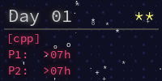
</a>
<a href="Day 02- Gift Shop/part1.cpp">
  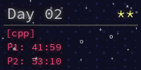
</a>
<a href="Day 03- Lobby/part1.cpp">
  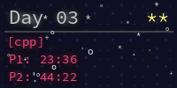
</a>
<a href="Day 04- PrintingDepartment/part1.cpp">
  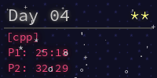
</a>
<a href="Day 05- Cafeteria/part1.cpp">
  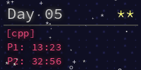
</a>
<a href="Day 06- TrashCompactor/part1.cpp">
  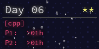
</a>
<a href="Day 07- Laboratories/part1.cpp">
  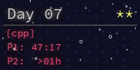
</a>
<a href="Day 08- Playground/part1.cpp">
  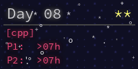
</a>
<a href="Day 09- MovieTheater/part1.cpp">
  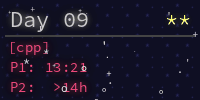
</a>
<a href="Day 10- Factory/part1.cpp">
  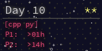
</a>
<a href="Day 11- Reactor/part1.cpp">
  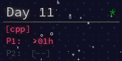
</a>
<a href="Day 12- ChristmasTreeFarm/part1.cpp">
  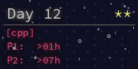
</a>
<!-- AOC TILES END -->

---

## 🎯 Why this repo exists

Advent of Code 2025 has been genuinely fun.

Some problems went smoothly, others didn’t, and a few only worked after multiple
failed attempts. Along the way I picked up and practiced things like:
- Disjoint Set Union (DSU)
- Dynamic programming
- Graph traversal (DFS / BFS)
- Turning messy problem statements into something solvable

Nothing fancy here just solutions, experiments, and the learning that came with them.

---

## 🚀 Compilation and Execution

Compile with `g++`:

```bash
g++ -O2 -std=c++17 file.cpp -o run
./run < input.txt
```

Compile with `clang++`:

```bash
clang++ -O2 -std=c++17 file.cpp -o run
./run < input.txt
```

---

## 🧠 About Advent of Code

Advent of Code (https://adventofcode.com/) is a programming challenge calendar released every December.
It’s great for improving algorithmic skills, practicing data structures, and having fun solving puzzles.

---

## 💡 Notes

This repository is my personal learning diary.
Each solution reflects my reasoning process and ongoing experiments with C++.

---

Happy AOC 2025! ✨